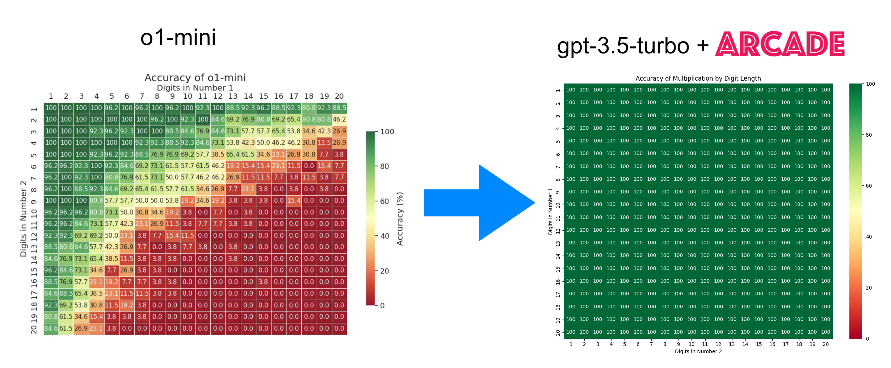

This benchmark replicates [a multiplication benchmark](https://x.com/yuntiandeng/status/1836114401213989366)
that even chain-of-thought models like `o1-mini` can't handle on its own. This code shows that giving
mathematical functions through function-calling makes older models such as `gpt3.5-turbo` achieve 100% on
the benchmark while being only a fraction of the price of newer models.

# Requirements

- Python 3.10
- pip
- An [Arcade.dev](https://arcade.dev) API key.

Install the requirements:

```bash
pip install -r requirements.txt
```

# Running the benchmark

Add your API key to the `.env` file:

```conf
ARCADE_API_KEY=arc_....
```

Then run 
```bash
python main.py
```

This will perform all multiplications through Arcade. You can modify the setup
in the `main.py` file. By default it will multiply numbers of 1 to 20 digits, 
with 5 trials per combination of digits to build the full matrix. 

Intermediate results will be stored in a `checkpoint.json` file, which allows
for interrupting the script and resume at a later time. The results of the full
run will be stored in a file named after the model and date. For example:
`results_gpt-3.5-turbo_2025-03-18_20-23-19.json` stores results for
`gpt-3.5-turbo`

To visualize the results, run the `chart.py` script passing the results JSON file
as an argument:

```bash
python chart.py -f <results.json>
```


